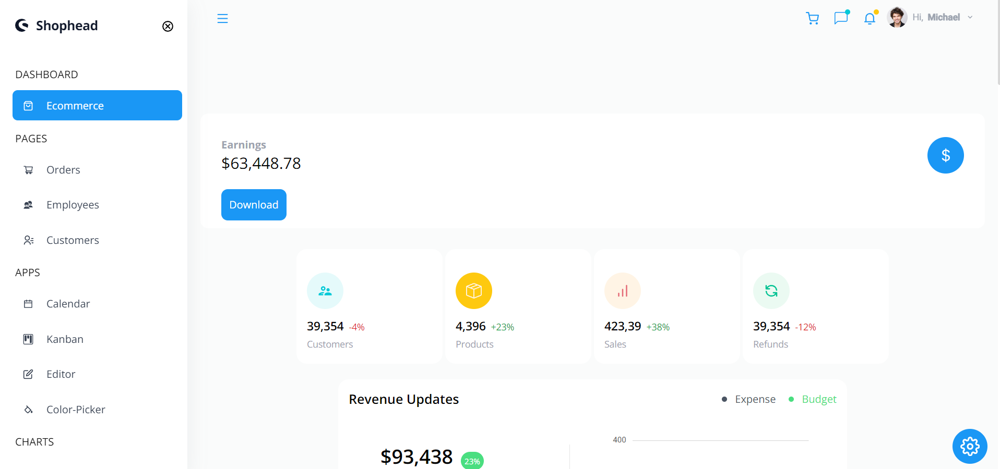
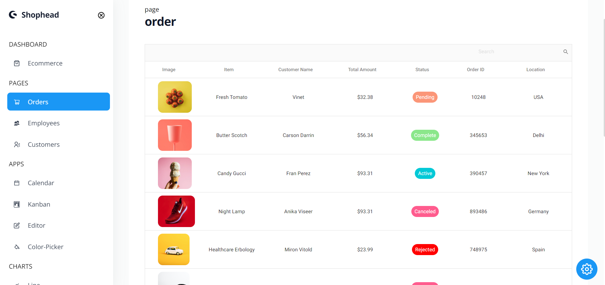
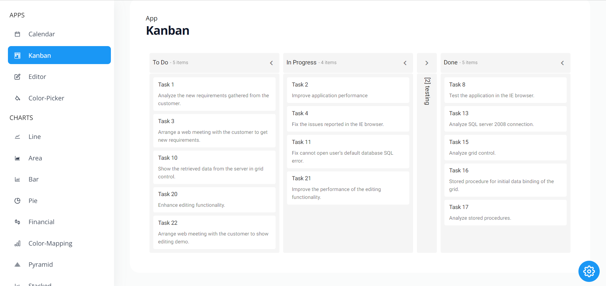
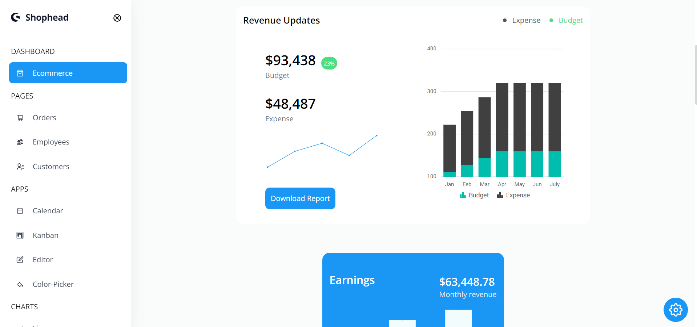

# React Multifunctional Dashboard

## Overview

Welcome to the **React Multifunctional Dashboard**! This project is a dynamic and feature-rich dashboard application built with React 18, Vite, and Syncfusion components. It demonstrates various functionalities including theming, data visualization, task management, and more, utilizing the Context API for efficient state management.

## Features

- **Theming**: Switch between different themes to customize the dashboard appearance.
- **Tables**: Interactive tables with search, sorting, and filtering capabilities.
- **Charts**: Visualize data with Syncfusion's diverse chart components.
- **Calendar**: Manage and view events using a fully integrated calendar component.
- **Kanban Board**: Organize tasks and projects with a Kanban board for agile project management.
- **Context API**: Manage state across the application efficiently.
- **Responsive Design**: Ensures usability and a consistent experience on various devices.

## Installation

To set up the project on your local machine, follow these steps:

1. **Clone the repository**:

 ```bash
   git clone https://github.com/featitx/Dashboard_react
```


### Acknowledgements
**React**: For building the user interface.
**Vite**: For fast and modern build tooling.
**Syncfusion**: For providing rich UI components.
**Context API**: For state management within the application.

### Contact
For any questions or feedback, please reach out to siddabdul7@gmail.com.

## Dashboard Screenshot

### Here is a screenshot of the dashboard:
  
  <br>
  
  <br>
  
  <br>
  


